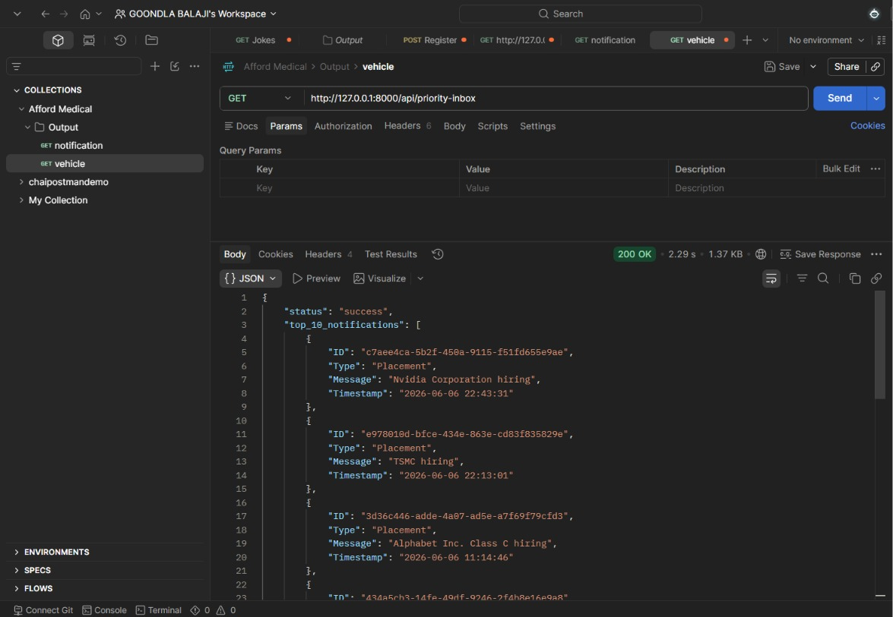
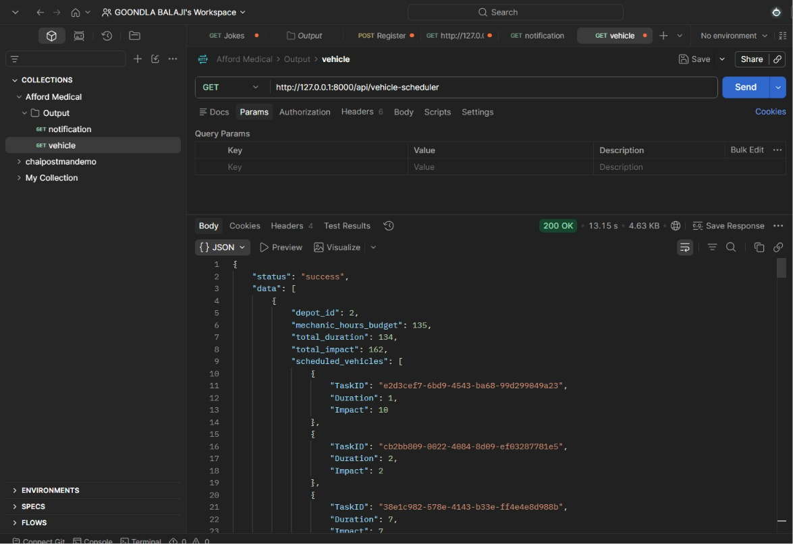

# Backend Assessment

This workspace contains three independent Python services used for assessment and prototyping:

- `logging_middleware`
- `vehicle_scheduler`
- `notification_app_be`

Each service has its own `app/` package and `requirements.txt` file.

## Output Screenshots

### Output 1

### Output 2

